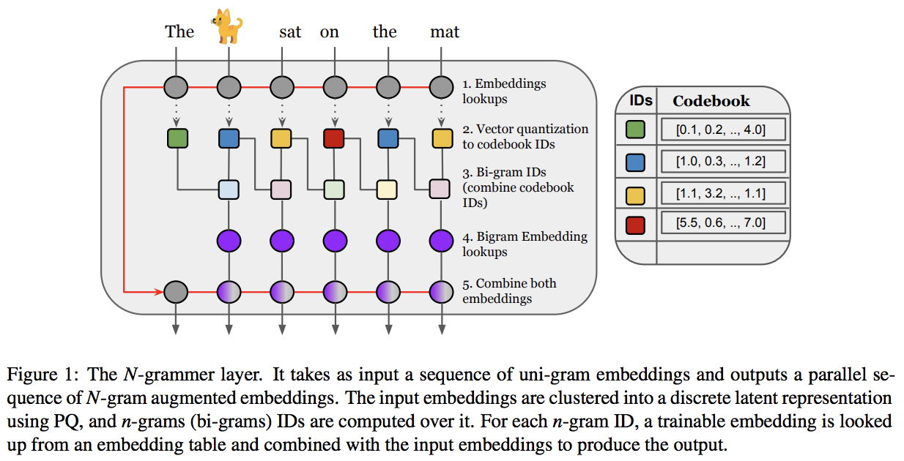

</img>

## N-Grammer - Pytorch

Implementation of <a href="https://openreview.net/forum?id=GxjCYmQAody">N-Grammer</a>, augmenting Transformers with latent n-grams, in Pytorch

## Install

```bash
$ pip install n-grammer-pytorch
````

## Usage

```python
import torch
from n_grammer_pytorch import VQNgrammer

vq_ngram = VQNgrammer(
    num_clusters = 1024,             # number of clusters
    dim_per_head = 32,               # dimension per head
    num_heads = 16,                  # number of heads
    ngram_vocab_size = 768 * 256,    # ngram vocab size
    ngram_emb_dim = 16,              # ngram embedding dimension
    decay = 0.999                    # exponential moving decay value
)

x = torch.randn(1, 1024, 32 * 16)
vq_ngram(x) # (1, 1024, 32 * 16)
```

## Citations

```bibtex
@inproceedings{thai2020using,
    title   = {N-grammer: Augmenting Transformers with latent n-grams},
    author  = {Anonymous},
    year    = {2021},
    url     = {https://openreview.net/forum?id=GxjCYmQAody}
}
```
